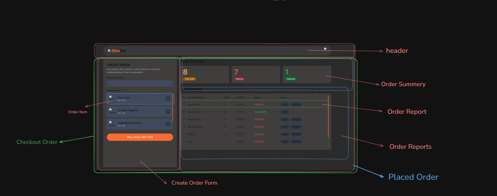

# Dine Out

# Todo: (Features)

1. Install React & tailwindCSS - done
2. Header - Done
   **main**
3. Sidebar ( Create Order ) - done

- Input Field ( Customer Name ) - done
- Items to choose - done
- OnClick the Plus(+) btn increase the Amount in "Place Order" btn - done
- OnClick the Minus(-) btn decrees the Amount in "Place Order" btn - done
- OnClick the "Place Item" - done
  - Update by 1 or the summery Total Order and Pending Order with all information - done

4. Order Summery - done

- Show total, Pending and Delivered Order - done

5. Order Reports - done

- Show all order reports with order information and actions btns ( Delete and Delivered ) - done
- OnClick the delivered Btn decrees 1 from Pending and Increase 1 On Delivered - done
- OnClick the delete btn Remove Report and Update Summery - done
- Filter By Status - done
